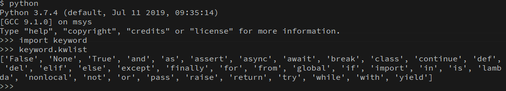

# Python3 基础语法

## 编码

默认情况下，Python 3 源码文件以 UTF-8 编码，所有字符串都是 unicode 字符串。 当然你也可以为源码文件指定不同的编码：

```python
# -*- coding: cp-1252 -*-
```

## 标识符

- 第一个字符必须是字母表中字母或下划线 `_` 。
- 标识符的其他的部分由字母、数字和下划线组成。
- 标识符对大小写敏感。

## 保留字



## 注释

```python
# 第一个注释
print ("Hello, Python!") # 第二个注释

'''
第三注释
第四注释
'''
"""
第五注释
第六注释
"""

```

## 行与缩进

Python 最具特色的就是使用缩进来表示代码块，不需要使用大括号 {} 。

缩进的空格数是可变的，但是同一个代码块的语句必须包含相同的缩进空格数。

## 多行语句

Python 通常是一行写完一条语句，但如果语句很长，我们可以使用反斜杠(\)来实现多行语句，例如：

```py
total = item_one + \
        item_two + \
        item_three
```

## 数字(Number)类型

Python 中数字有四种类型：整数(int)、布尔型(bool)、浮点数(float)和复数(complex)。

## 字符串(String)

- python 中单引号和双引号使用完全相同。
- 使用三引号('''或""")可以指定一个多行字符串。
- 转义符 '\'
- 反斜杠可以用来转义，使用 r 可以让反斜杠不发生转义。。 如 r"this is a line with \n" 则\n 会显示，并不是换行。
- 按字面意义级联字符串，如"this " "is " "string"会被自动转换为 this is string。
- 字符串可以用 + 运算符连接在一起，用 \* 运算符重复。
- Python 中的字符串有两种索引方式，从左往右以 0 开始，从右往左以 -1 开始。
- Python 中的字符串不能改变。
- Python 没有单独的字符类型，一个字符就是长度为 1 的字符串。
- 字符串的截取的语法格式如下：变量[头下标:尾下标:步长]

```py
word = '字符串'
sentence = "这是一个句子。"
paragraph = """这是一个段落，
可以由多行组成"""
```

## 空行

函数之间或类的方法之间用空行分隔，表示一段新的代码的开始。类和函数入口之间也用一行空行分隔，以突出函数入口的开始。

空行与代码缩进不同，空行并不是 Python 语法的一部分。书写时不插入空行，Python 解释器运行也不会出错。但是空行的作用在于分隔两段不同功能或含义的代码，便于日后代码的维护或重构。

**_空行也是程序代码的一部分。_**

## import 与 from...import

- 在 python 用 import 或者 from...import 来导入相应的模块。
- 将整个模块(somemodule)导入，格式为： `import somemodule`
- 从某个模块中导入某个函数,格式为： `from somemodule import somefunction`
- 从某个模块中导入多个函数,格式为： `from somemodule import firstfunc, secondfunc, thirdfunc`
- 将某个模块中的全部函数导入，格式为： `from somemodule import \*`
